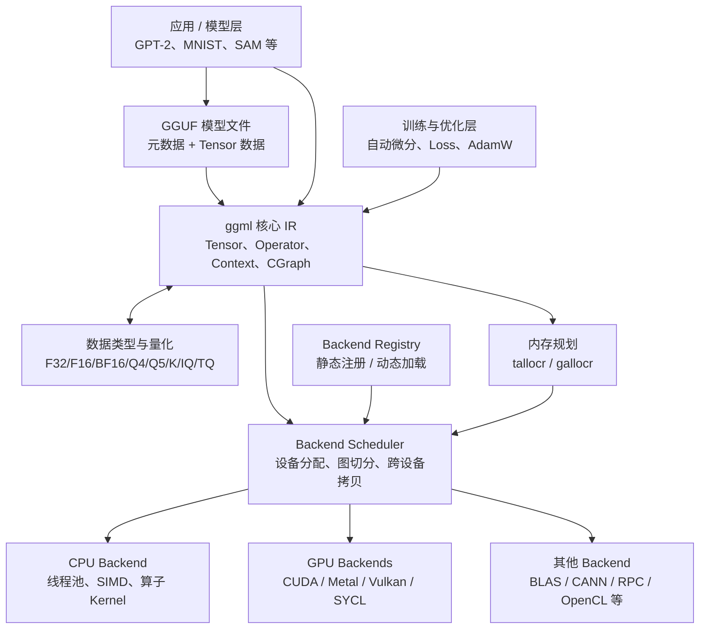
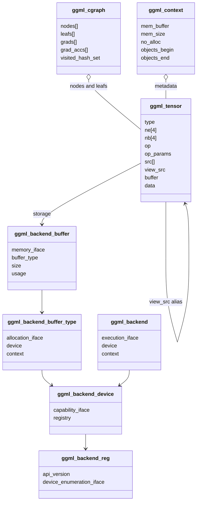
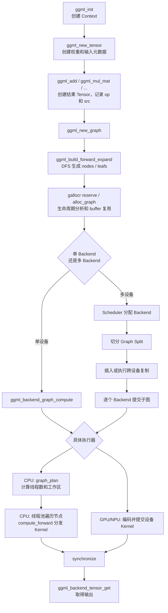

# ggml 架构概览

本文基于当前仓库源码，介绍 ggml 的总体架构、核心模块、关键结构体以及一次计算图的完整执行流程。

一句话概括：

> ggml 是一个以 `ggml_tensor` 为中心、显式构建计算图、显式规划内存，并通过可插拔 Backend 执行的轻量级张量计算引擎。

它不是完整的深度学习框架：模型结构、Tokenizer、采样等通常由上层项目负责；ggml 主要提供 Tensor、计算图、量化、内存规划和跨硬件执行能力。

## 1. 总体架构



构建层面上，基础实现被编译为 `ggml-base`，Backend 注册层是 `ggml`，具体硬件实现作为独立 Backend 库链接或动态加载，参见 [`src/CMakeLists.txt`](../src/CMakeLists.txt)。

## 2. 核心模块

| 模块 | 主要源码 | 职责 |
|---|---|---|
| Tensor、算子、计算图 | [`include/ggml.h`](../include/ggml.h)、[`src/ggml.c`](../src/ggml.c) | Tensor 元数据、算子构图、正反向图 |
| Context/Arena | [`src/ggml.c`](../src/ggml.c) | 管理 Tensor、Graph 等元数据及可选的数据内存 |
| 图内存分配 | [`include/ggml-alloc.h`](../include/ggml-alloc.h)、[`src/ggml-alloc.c`](../src/ggml-alloc.c) | 分析 Tensor 生命周期、复用计算 buffer |
| Backend 抽象 | [`include/ggml-backend.h`](../include/ggml-backend.h)、[`src/ggml-backend-impl.h`](../src/ggml-backend-impl.h) | 统一内存、设备、执行流、事件接口 |
| 多 Backend 调度 | [`src/ggml-backend.cpp`](../src/ggml-backend.cpp) | 节点设备分配、切分子图、跨设备复制 |
| Backend 注册 | [`src/ggml-backend-reg.cpp`](../src/ggml-backend-reg.cpp) | 枚举设备，静态注册或动态加载 Backend |
| CPU 执行器 | [`src/ggml-cpu/`](../src/ggml-cpu) | 算子分发、SIMD Kernel、线程池、工作区规划 |
| 量化 | [`src/ggml-common.h`](../src/ggml-common.h)、[`src/ggml-quants.c`](../src/ggml-quants.c) | 量化块格式、量化与反量化实现 |
| GGUF | [`include/gguf.h`](../include/gguf.h)、[`src/gguf.cpp`](../src/gguf.cpp) | 模型元数据及 Tensor 数据序列化 |
| 优化器 | [`include/ggml-opt.h`](../include/ggml-opt.h)、[`src/ggml-opt.cpp`](../src/ggml-opt.cpp) | Dataset、Loss、反向图、AdamW 高层封装 |

## 3. 核心数据结构

### 3.1 `ggml_tensor`：数据描述符，同时也是计算图节点

定义位于 [`include/ggml.h`](../include/ggml.h)。

关键字段：

- `type`：F32、F16、Q4_0、Q4_K 等数据类型。
- `ne[4]`：各维元素数量，`ne[0]` 是内存中变化最快的维度。
- `nb[4]`：各维字节步长，因此支持转置、切片和非连续 Tensor。
- `op`：产生该 Tensor 的算子。
- `src[]`：该算子的输入 Tensor，也是计算图的边。
- `op_params`：RoPE、归一化、卷积等算子的附加参数。
- `buffer`、`data`：实际存储所在的 Backend buffer 和地址。
- `view_src`、`view_offs`：Tensor view，共享另一个 Tensor 的数据。
- `flags`：输入、输出、模型参数、Loss 等语义。
- `extra`：Backend 专用扩展数据。

ggml 没有单独的 Operator Node 对象。例如：

```c
struct ggml_tensor * c = ggml_add(ctx, a, b);
```

本质上创建了一个新 Tensor：

```text
c.op     = GGML_OP_ADD
c.src[0] = a
c.src[1] = b
```

此时尚未进行实际计算。算子函数主要负责检查形状、创建输出 Tensor，并设置 `op`、`src` 和 `op_params`。

### 3.2 `ggml_context` 与 `ggml_object`

定义位于 [`src/ggml.c`](../src/ggml.c)。

`ggml_context` 是一个 Arena：

- `mem_buffer`、`mem_size`：预分配内存池。
- `objects_begin`、`objects_end`：Arena 中对象的链表。
- `no_alloc`：是否只创建元数据，不分配 Tensor 数据。
- `mem_buffer_owned`：Context 是否拥有底层内存。

`ggml_object` 是 Arena 中每个 Tensor、Graph 或工作区前面的内部对象头。

这里存在两个容易混淆的内存层次：

1. Context 通常负责 Tensor 和 Graph 的元数据生命周期。
2. Backend buffer 负责真正的权重和计算数据。
3. 当 `no_alloc == false` 时，Tensor 数据也可以直接放在 Context Arena 中。

现代 Backend 用法一般让 Context 使用 `no_alloc=true`，随后由 Backend allocator 分配数据。

### 3.3 `ggml_cgraph`

定义位于 [`src/ggml-impl.h`](../src/ggml-impl.h)。

主要字段：

- `nodes`：需要执行的算子 Tensor，按拓扑顺序排列。
- `leafs`：不依赖其他运算结果的输入、权重和常量。
- `grads`：Tensor 对应的梯度。
- `grad_accs`：梯度累加 Tensor。
- `visited_hash_set`：建图时对 Tensor 去重。
- `order`：DFS 遍历顺序。

`ggml_build_forward_expand()` 从输出 Tensor 开始，沿 `src[]` 反向做 DFS。父节点先进入图，因此最终得到可以直接顺序执行的节点列表。

自动微分也没有独立的梯度 IR。`ggml_build_backward_expand()` 根据正向算子创建新的梯度算子 Tensor，并将它们追加到计算图中。

### 3.4 核心结构关系



### 3.5 Backend 结构

Backend 使用 C 风格的“结构体 + 函数表”实现多态：

- `ggml_backend_buffer_type`：一种内存类型，定义对齐、分配大小以及如何创建 buffer。
- `ggml_backend_buffer`：一次实际内存分配，负责 Tensor 的 set、get、copy 和 clear。
- `ggml_backend`：执行流或命令队列，负责提交计算图和同步。
- `ggml_backend_device`：物理或逻辑设备，报告能力并创建 Backend。
- `ggml_backend_reg`：一个 Backend 插件入口，负责枚举设备。

对应的函数表集中定义在 [`src/ggml-backend-impl.h`](../src/ggml-backend-impl.h)。

这种分层将“存储在哪里”和“由谁执行”分开。例如，某个 Backend 可能能够直接访问另一个 Backend 创建的 host buffer，而不需要重新分配数据。

### 3.6 `ggml_gallocr`

Graph allocator 定义在 [`src/ggml-alloc.c`](../src/ggml-alloc.c)，负责计算阶段的临时内存：

- 统计每个 Tensor 的消费者数量和 view 数量。
- 最后一个消费者执行后回收其输入空间。
- 保证输出 Tensor 不被覆盖。
- 当布局相同、只有一个消费者且不存在 view 别名时，允许输出复用输入内存。
- 支持先使用最大图执行 `reserve`，运行时避免重复申请。

因此 ggml 所说的“运行时零分配”，通常指提前完成 Arena、Backend buffer 和工作区的预留，而不是完全不存在内存管理。

### 3.7 `ggml_backend_sched`

多设备调度器定义在 [`src/ggml-backend.cpp`](../src/ggml-backend.cpp)，内部维护：

- Backend 和对应 buffer type 数组。
- Tensor 到 Backend 的映射。
- 跨 Backend Tensor 副本。
- Graph split 列表。
- 一个支持多 buffer 的 `ggml_gallocr`。
- Event 和多份输入副本，用于流水并行。

调度大致分为：

1. 根据预分配权重所在位置确定 Backend。
2. 根据 `supports_op()` 和相邻节点扩展设备分配。
3. 优先选择高优先级且内存兼容的 Backend。
4. 按 Backend 变化切分计算图。
5. 为不兼容的跨设备输入创建副本。
6. 复制输入后逐个提交 split。

## 4. 一次典型推理的执行流程



### 4.1 构图阶段

调用 `ggml_add()`、`ggml_mul_mat()` 等函数时，ggml 只创建新的 Tensor 并记录依赖，不执行 Kernel。

`ggml_build_forward_expand()` 从指定输出回溯所有输入，生成拓扑有序的 `nodes` 和 `leafs`。

### 4.2 内存规划阶段

对于静态权重，可以使用 `ggml_backend_alloc_ctx_tensors()` 一次性分配。

对于计算图中的中间结果，`ggml_gallocr_reserve()` 首先测量需要的峰值内存，`ggml_gallocr_alloc_graph()` 再将 Tensor 绑定到已分配的 Backend buffer。

### 4.3 调度阶段

单 Backend 场景可以直接调用 `ggml_backend_graph_compute()`。

多 Backend 场景通过 `ggml_backend_sched`：

- 为每个节点选择 Backend。
- 将连续、位于相同 Backend 的节点组成一个 split。
- 在 split 边界处理数据复制和同步。
- 分别调用各 Backend 的 `graph_compute` 接口。

### 4.4 CPU 执行阶段

CPU Backend 中，`ggml_graph_plan()` 会为每种算子计算任务数和最大工作区。

线程池中的所有活跃线程按拓扑顺序遍历节点，每个节点执行后经过 barrier，再进入下一个节点。因此 CPU 并行模式主要是：

```text
图节点之间：基本按拓扑顺序执行
单个节点内部：按行、块或任务切给多个线程
```

算子最终由 `ggml_compute_forward()` 根据 `tensor->op` 分发到对应 CPU Kernel。

## 5. 量化在架构中的位置

量化不是外部压缩插件，而是 ggml 类型系统的一部分：

- `enum ggml_type` 直接包含 Q4、Q5、Q8、K-quant、IQ、TQ 等类型。
- `ggml_type_traits` 描述块大小、存储大小和转换函数。
- `block_q4_0`、`block_q4_K` 等结构定义真实内存布局。
- CPU 的 `ggml_type_traits_cpu` 将每种权重类型绑定到对应的量化函数和向量点积 Kernel。

例如 `Q4_0` 不是每个元素占四位的简单数组，而是一个块结构：

```c
typedef struct {
    ggml_half d;
    uint8_t qs[QK4_0 / 2];
} block_q4_0;
```

其中一个 block 表示 32 个权重，`d` 是缩放因子，`qs` 存放打包后的四位量化值。

因此矩阵乘法可以直接在量化块上执行，而不必先把整个权重 Tensor 解压为 F32；通常只对输入行做必要的临时转换。

## 6. GGUF 与执行引擎的关系

GGUF 是模型存储格式，不是计算图格式。它主要保存：

- 模型元数据键值对。
- Tensor 名称、维度、数据类型和数据偏移。
- 对齐后的 Tensor 数据块。

加载 GGUF 时可以创建对应的 `ggml_tensor` 元数据；上层应用仍需根据模型架构，用这些权重 Tensor 构造实际计算图。

也就是说：

```text
GGUF 负责“有哪些权重、权重在哪里”
上层模型代码负责“这些权重如何组成网络”
ggml 负责“图如何分配内存并在设备上执行”
```

## 7. 自动微分与优化器

`ggml_build_backward_expand()` 从带有 `PARAM` 和 `LOSS` 标记的正向图出发：

1. 为需要梯度的 Tensor 建立梯度映射。
2. 反向遍历正向节点。
3. 根据各算子的求导规则创建新的 Tensor 运算。
4. 将梯度计算追加到原计算图。

[`ggml-opt.cpp`](../src/ggml-opt.cpp) 在此基础上进一步构造：

- 前向图 `gf`。
- 梯度图 `gb_grad`。
- 包含 AdamW 更新步骤的图 `gb_opt`。

因此训练步骤最终仍然是一张普通的 ggml 计算图，由相同的 allocator 和 Backend scheduler 执行。

## 8. 设计特点与使用注意事项

### 8.1 Tensor 就是 IR 节点

数据描述和算子节点合二为一，结构简单、构图成本低，但 Tensor 同时承担较多语义。

### 8.2 建图与计算分离

调用算子函数只是声明运算。只有执行 graph compute 时，Backend Kernel 才真正运行。

### 8.3 元数据与数据存储分离

释放 Context 不一定会释放 Backend buffer；反过来释放 Backend buffer 后，Tensor 中的数据地址也会失效。应用需要明确二者的生命周期。

### 8.4 必须正确处理 `ne` 和 `nb`

不能假定 Tensor 一定连续。转置、排列和 view 主要通过改变步长和偏移实现。

对于量化类型，`nb[0]` 对应量化块大小，`nb[1]` 才表示一整行的字节跨度。

### 8.5 View 具有别名语义

`view_src` Tensor 不拥有独立数据。Allocator 在进行原地复用前必须同时分析普通消费者和 view 使用者。

### 8.6 Backend 能力并不完全一致

每个 Backend 通过 `supports_op()` 和 `supports_buft()` 声明能力。不支持的节点可能回退到 CPU，或者导致额外的跨设备复制。

## 9. 总结

ggml 的核心设计可以归纳为七点：

1. **Tensor 就是 IR 节点**：数据描述和算子节点合二为一。
2. **建图与计算分离**：调用算子函数只是声明运算。
3. **元数据与数据存储分离**：Context 管元数据，Backend buffer 管设备数据。
4. **内存生命周期显式规划**：通过生命周期分析和安全的原地复用降低峰值内存。
5. **Backend 是可插拔执行层**：相同计算图可以交给 CPU、CUDA、Metal、Vulkan 或多个设备共同执行。
6. **量化是一等数据类型**：类型、内存布局和计算 Kernel 从底层统一设计。
7. **控制权留给上层**：ggml 提供底层机制，上层项目决定模型结构、权重加载、批处理和设备策略。
