# ggml CPU 架构、状态与内存生命周期

本文是当前仓库的源码导读和架构图集，重点回答三个问题：

1. ggml 的各层分别解决什么问题，模块之间如何依赖；
2. `context`、Tensor 元数据、权重、计算中间结果和 CPU 工作区分别由谁分配、由谁释放；
3. 从 GGUF 加载模型到构图、分配、CPU 推理和退出，状态如何变化。

文档基于提交 `9d47911eb3e5c55b35450aa7dafeb4b435c66b32`。这里只展开 CPU Backend；其他 Backend 只作为抽象层存在，不介绍其内部实现。训练相关的自动微分和优化器只标出模块边界，推理主线不展开。

---

## 1. 先建立一个正确的心智模型

一句话概括：

> ggml 是一个以 `ggml_tensor` 作为 IR 节点、显式构图、显式规划数据内存，并通过 Backend 执行 Kernel 的轻量级张量引擎。

最重要的分层不是“模型层数”，而是下面四类对象：

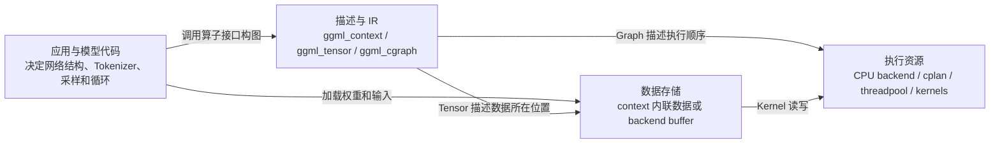

必须始终区分：

- `ggml_context` 主要是对象元数据的 Arena；在旧式路径中也可以内联保存 Tensor 数据。
- `ggml_tensor` 是描述符，同时也是计算图中的 Operator Node。
- `ggml_backend_buffer` 才是 Backend 路径里实际保存权重或中间结果的数据区。
- `ggml_cgraph` 只保存拓扑顺序和 Tensor 指针，不拥有 Tensor 数据。
- `ggml_backend` 代表执行接口和执行状态，不拥有模型权重 buffer。
- GGUF 保存权重与元数据，但不保存可直接执行的计算图。

---

## 2. 仓库的宏观层级与模块依赖

### 2.1 运行时架构

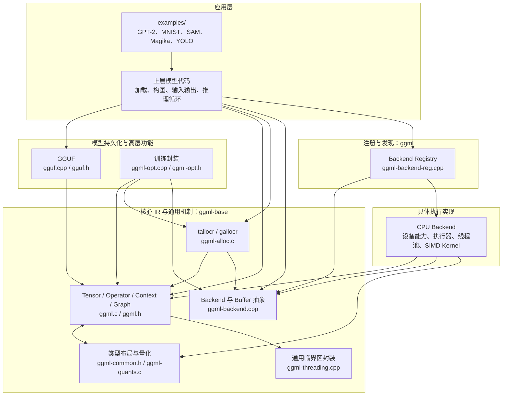

### 2.2 CMake 目标依赖

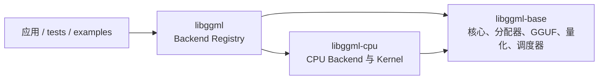

构建边界以 [`src/CMakeLists.txt`](../src/CMakeLists.txt) 为准：

| 目标 | 主要源文件 | 责任 |
|---|---|---|
| `ggml-base` | `ggml.c`、`ggml-alloc.c`、`ggml-backend.cpp`、`gguf.cpp`、`ggml-quants.c`、`ggml-opt.cpp` | 与具体设备无关的 IR、内存机制、Backend ABI 和持久化 |
| `ggml` | `ggml-backend-reg.cpp` | Backend 静态注册、动态发现和 Device 枚举 |
| `ggml-cpu` | `src/ggml-cpu/` | CPU Device、CPU Backend、线程池、算子分派、SIMD/量化 Kernel |
| `examples` | `examples/` | 模型结构和正确使用方式的参考，不属于核心引擎 |
| `tests` | `tests/` | 算子、分配器、Backend 和量化验证 |

一个值得注意的设计点是：通用 CPU host buffer 的实现位于 `ggml-backend.cpp`，而 CPU 的图执行器位于 `src/ggml-cpu/ggml-cpu.cpp` 和 `ggml-cpu.c`。因此“CPU 存储”和“CPU 执行”在代码上也是分离的。

---

## 3. 核心对象关系：Tensor 是整个系统的交叉点

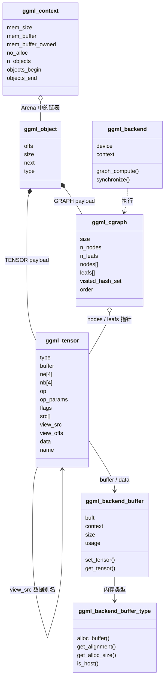

### 3.1 Tensor 同时是数据描述符和 IR 节点

例如：

```c
struct ggml_tensor * c = ggml_add(ctx, a, b);
```

该调用不会立刻计算，而是创建一个新的 Tensor：

```text
c->op     = GGML_OP_ADD
c->src[0] = a
c->src[1] = b
```

算子接口的通用内部逻辑如下：

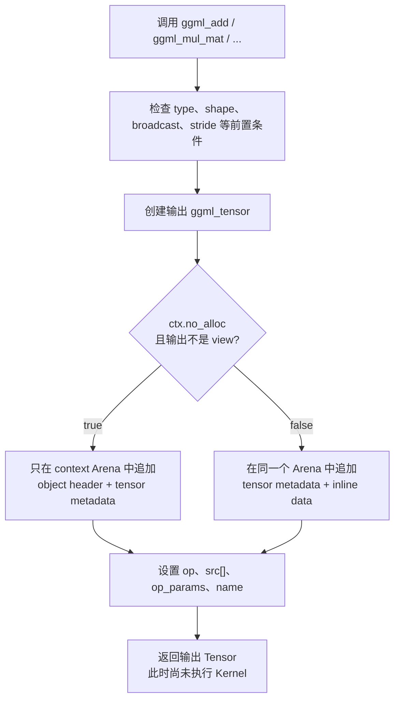

以 `ggml_mul_mat()` 为例，它检查形状，创建 F32 输出 Tensor，然后设置 `GGML_OP_MUL_MAT` 和两个输入指针，参见 [`src/ggml.c:2693`](../src/ggml.c#L2693)。

### 3.2 `ne[]`、`nb[]` 和量化块

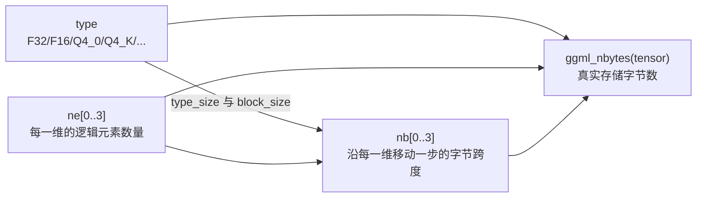

`ne[0]` 是变化最快的维度。普通 F32 Tensor 的 `nb[0]` 通常为 4；量化 Tensor 的 `nb[0]` 是一个量化块结构的大小，而不是“单个逻辑元素的字节数”。因此不能用 `元素数 × sizeof(type)` 统一计算量化 Tensor 大小，应使用 `ggml_row_size()` 或 `ggml_nbytes()`。

### 3.3 View 是数据别名，不是复制

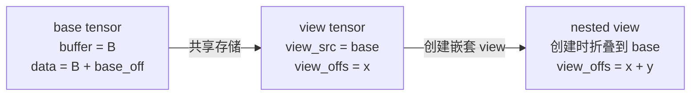

`reshape`、`view`、`permute`、`transpose` 通常只创建元数据并共享底层存储。Backend 分配后，`ggml_backend_view_init()` 将 view 的 `buffer` 设置为 base tensor 的 buffer，并令：

```text
view->data = view_src->data + view_offs
```

所以 allocator 必须追踪 view 数量，不能在仍有 view 存活时复用 base tensor 的内存。

---

## 4. `ggml_init()`：创建的是固定大小 Arena，不是可增长容器

### 4.1 初始化分支与状态变化

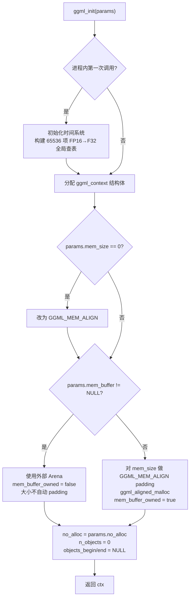

关键事实：

- Context 自身总会分配；`no_alloc=true` 不等于“零内存分配”。
- Context Arena 大小创建后不会增长。空间不足时 `ggml_new_object()` 在 Debug 构建中直接终止，在 Release 构建中返回空指针；许多上层创建接口随后仍会断言该指针非空，因此不要把空间不足当作可恢复流程。
- 内部 Arena 使用 `ggml_aligned_malloc()`；当前实现申请 64 字节对齐地址。
- `GGML_MEM_ALIGN` 用于 Context 内对象布局，64 位环境通常是 16。
- Backend Tensor 默认对齐由 `TENSOR_ALIGNMENT` 决定，当前为 32。这是不同的对齐层次。

### 4.2 Arena 中对象的追加方式

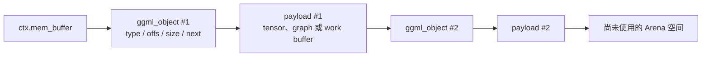

`ggml_new_object()` 是 bump allocation：根据尾对象计算下一个偏移、对 payload 做对齐，然后把新对象接到链表末尾。它不单独释放某个对象，也不做碎片整理。

---

## 5. `no_alloc` 的精确定义

`ctx->no_alloc` 只控制 `ggml_new_tensor_impl()` 为“非 view Tensor”创建元数据时，是否把数据空间一起放进 Context Arena。

### 5.1 创建 Tensor 时的判断

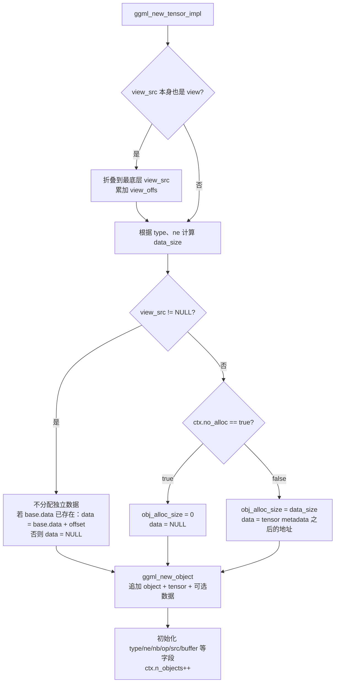

### 5.2 `true` 与 `false` 的内存布局

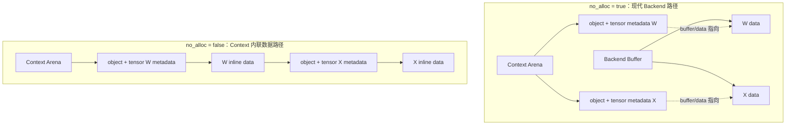

| 状态 | `tensor->data` | `tensor->buffer` | 数据所有者 |
|---|---:|---:|---|
| `no_alloc=true`，刚创建 | `NULL` | `NULL` | 尚无数据存储 |
| `no_alloc=true`，Backend allocator 之后 | 非空 | 非空 | `ggml_backend_buffer` |
| `no_alloc=false`，刚创建 | 非空 | `NULL` | `ggml_context` Arena |
| view，base 尚未分配 | `NULL` | `NULL` | 等待 base 分配 |
| view，Backend 初始化后 | `base->data + offset` | 与 base 相同 | base 的 Backend buffer |

这解释了一个表面上的矛盾：

```text
ctx->no_alloc == true
tensor->data  != NULL
```

这是完全合法的。前者是“以后创建 Tensor 的策略”，后者是“这个 Tensor 当前是否已绑定数据”。

### 5.3 `ggml_set_no_alloc()` 不是迁移或释放接口

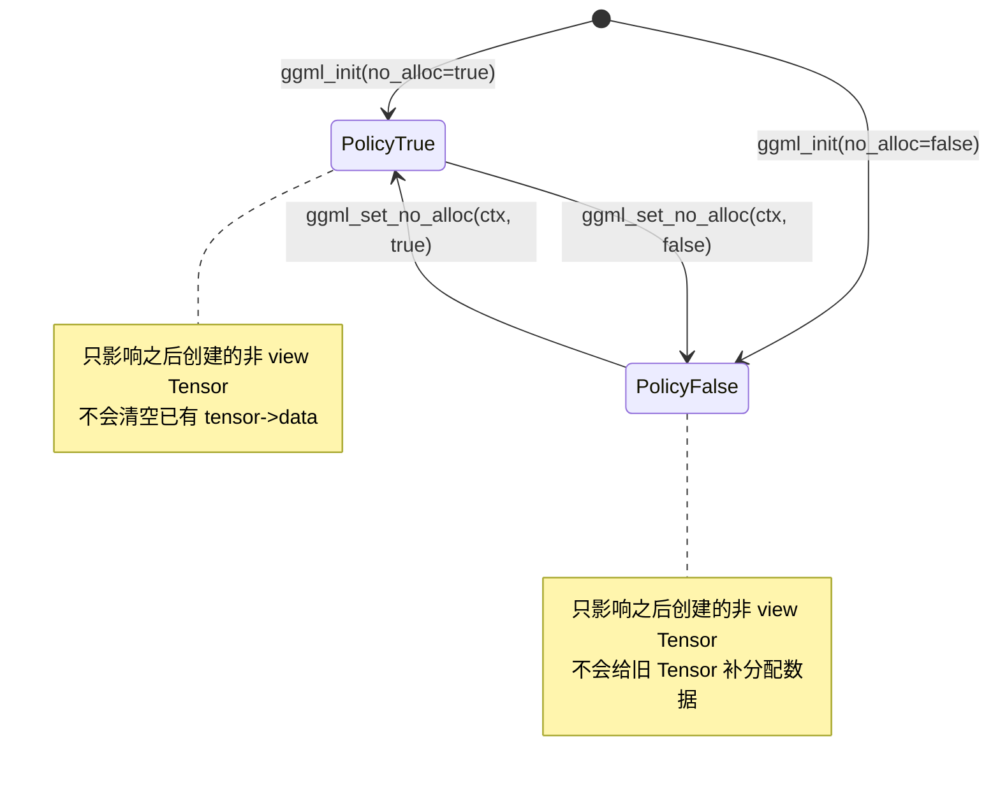

### 5.4 `ggml_reset()` 和 `ggml_free()`

`ggml_reset(ctx)` 只执行：

```text
n_objects     = 0
objects_begin = NULL
objects_end   = NULL
```

它不会：

- 清零 Arena；
- 改变 `no_alloc`；
- 释放外部 `mem_buffer`；
- 释放任何 Backend buffer；
- 保证旧 Tensor/Graph 指针继续有效。

下一次创建对象会从 Arena 开头覆盖旧内容，所以 reset 后所有旧对象都应视为失效。

`ggml_free(ctx)` 释放 Context 结构体；只有 `mem_buffer_owned=true` 时才释放 Arena。它同样不会释放 Backend buffer。

---

## 6. GGUF 加载与 `gguf_init_params.no_alloc`

这里存在两个不同的 Context：

```text
返回值 gguf_context *        ：GGUF header、KV、tensor info、文件 offset
params.ctx 输出 ggml_context *：可选的 ggml_tensor 描述符及权重数据
```

### 6.1 完整决策图

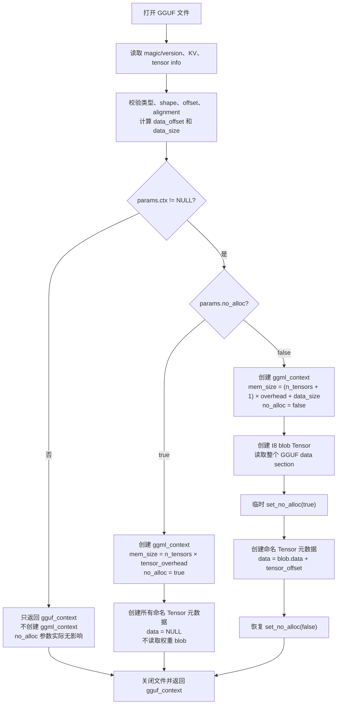

### 6.2 结果矩阵

| `params.ctx` | `no_alloc` | `gguf_context` | 输出的 `ggml_context` | 权重数据 |
|---|---|---|---|---|
| `NULL` | 任意 | 完整元数据 | 不创建 | 不读取 |
| 非空 | `true` | 完整元数据，内部 `data=null` | 只有命名 Tensor 元数据 | 不读取，Tensor `data=null` |
| 非空 | `false` | 完整元数据，内部 `data` 指向 blob | Tensor 元数据 + I8 blob | 已读入 Context Arena，命名 Tensor 指向 blob 偏移 |

`no_alloc=true` 不是 mmap，也不是延迟文件句柄。函数返回前文件已经关闭；应用必须重新打开文件，并根据：

```text
file_offset = gguf_get_data_offset(gguf_ctx)
            + gguf_get_tensor_offset(gguf_ctx, tensor_id)
```

读取每个权重。

---

## 7. Backend 抽象：内存类型、内存实例和执行流彼此独立

### 7.1 Backend 对象层级

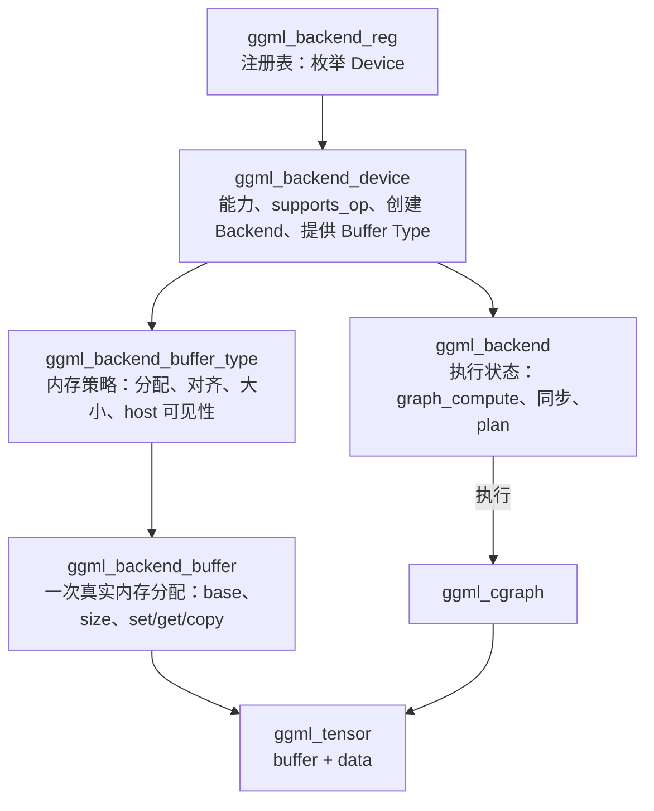

Backend 使用“结构体 + 函数表”模拟多态。主要函数表定义在 [`src/ggml-backend-impl.h`](../src/ggml-backend-impl.h)：

- Buffer Type 决定如何申请内存，以及 Tensor 对齐和实际分配大小。
- Buffer 决定如何读写、清零和复制数据。
- Backend 决定如何执行 Graph 和同步。
- Device 报告能力并创建 Backend。
- Registry 枚举静态或动态 Backend。

### 7.2 CPU Backend 的具体映射

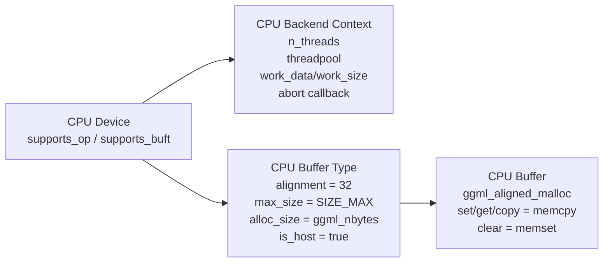

CPU Backend 初始化时：

- 调用 `ggml_cpu_init()` 完成 CPU 功能初始化；
- 默认线程数设为 `GGML_DEFAULT_N_THREADS`；
- `threadpool=null`；
- `work_data=null`、`work_size=0`；
- abort callback 为空。

CPU 的同步函数为空，因此 `ggml_backend_graph_compute()` 对 CPU 是同步完成后返回。

### 7.3 CPU `supports_op()` 的主要判断

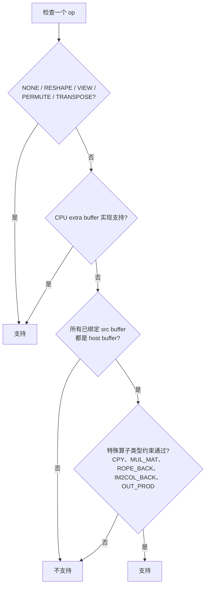

---

## 8. `ggml_backend_alloc_ctx_tensors()` 如何申请权重内存

该接口适合“生命周期与模型相同”的静态 Tensor，例如权重、长期 KV cache 或固定输入缓冲区。它不是计算图临时内存规划器。

### 8.1 调用关系

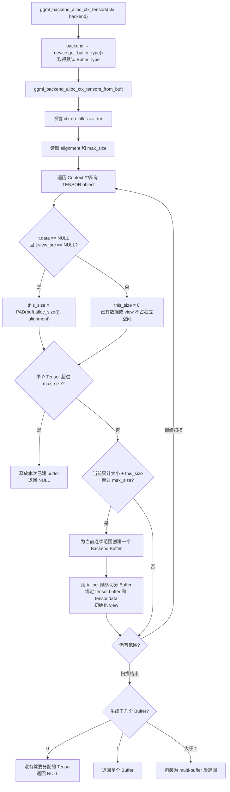

### 8.2 `tallocr` 如何把一个 Buffer 切给多个 Tensor

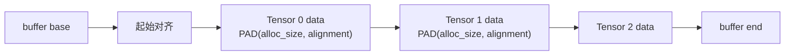

每次 `ggml_tallocr_alloc()`：

1. 通过 Buffer Type 取得 Tensor 的实际分配大小；
2. 按 Buffer alignment 向上取整；
3. 检查剩余空间；
4. 调用 `ggml_backend_tensor_alloc(buffer, tensor, addr)`；
5. 后者设置 `tensor->buffer`、`tensor->data`，再调用可选的 Backend Tensor 初始化。

对普通 CPU Buffer：

```text
alignment = 32
alloc_size(t) = ggml_nbytes(t)
max_size = SIZE_MAX
buffer_size ≈ Σ PAD(ggml_nbytes(t), 32)
```

因此 CPU 通常只创建一个大权重 Buffer。接口仍支持有最大 Buffer 限制的实现，并在必要时返回一个 multi-buffer 包装。

### 8.3 调用后的状态

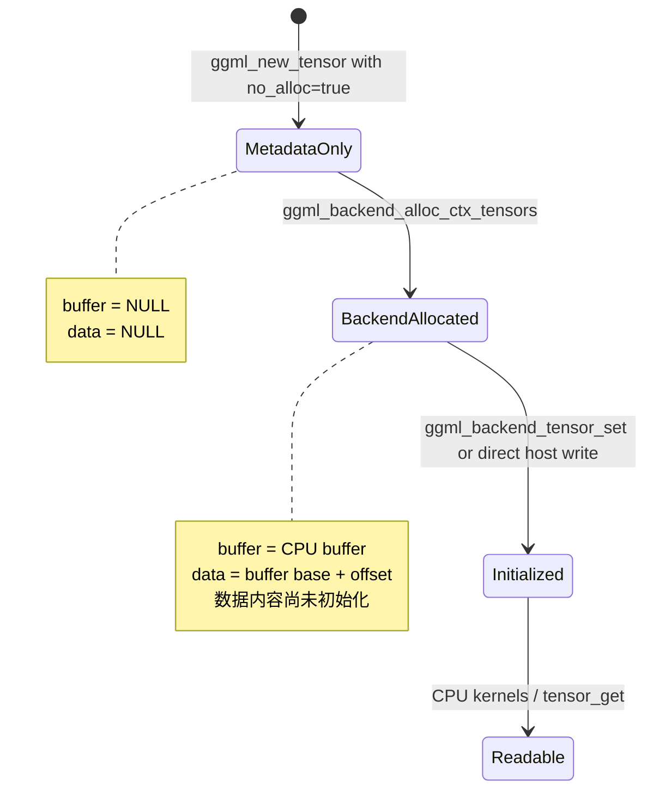

注意：分配只保证“有地址”，不会自动从 GGUF 加载内容。必须再调用 `ggml_backend_tensor_set()` 或在确认是 host buffer 后直接写入 `tensor->data`。

### 8.4 CPU 权重加载路径

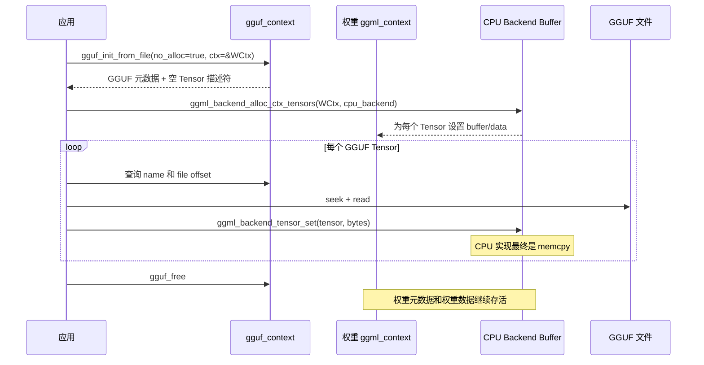

CPU Buffer 的 `is_host=true`，所以也可以直接 `fread(tensor->data, ...)`。使用 `ggml_backend_tensor_set()` 更统一；使用直接读取可避免逐 Tensor 的临时 staging buffer。

---

## 9. 计算图如何形成

### 9.1 从输出 Tensor 反向 DFS

```mermaid
flowchart TD
    OUTPUT["最终输出 Tensor"]
    VISIT["ggml_visit_parents(tensor)"]
    SEEN{"visited_hash_set 中已存在?"}
    RETURN["跳过，避免重复和环形访问"]
    SRCS["按求值顺序递归访问 src[]"]
    CLASSIFY{"op == NONE<br/>且不是 PARAM?"}
    LEAF["加入 leafs[]<br/>权重、输入、常量"]
    NODE["加入 nodes[]<br/>可执行结果或 PARAM"]
    ORDER["父节点先加入，输出后加入<br/>得到拓扑执行顺序"]

    OUTPUT --> VISIT --> SEEN
    SEEN -->|是| RETURN
    SEEN -->|否| SRCS --> CLASSIFY
    CLASSIFY -->|是| LEAF --> ORDER
    CLASSIFY -->|否| NODE --> ORDER
```

`ggml_build_forward_expand()` 可以多次调用，把多个输出扩展到同一张图；visited hash 会去重。Graph 的 `size` 是 nodes/leafs 的容量上限，超过后会触发断言。

### 9.2 构图与执行是两个完全不同的阶段

```mermaid
sequenceDiagram
    participant App as 应用
    participant Ctx as Graph Context
    participant Tensor as Tensor IR
    participant Graph as cgraph
    participant Alloc as gallocr
    participant CPU as CPU Backend

    App->>Ctx: ggml_init(no_alloc=true)
    App->>Tensor: ggml_mul_mat / add / soft_max / ...
    Note over Tensor: 只创建输出描述符并设置 op/src
    App->>Graph: ggml_new_graph
    App->>Graph: ggml_build_forward_expand(output)
    Graph-->>App: nodes + leafs 拓扑序
    App->>Alloc: ggml_gallocr_alloc_graph(graph)
    Alloc-->>Tensor: 为未分配 Tensor 绑定计算 Buffer
    App->>CPU: ggml_backend_graph_compute(graph)
    CPU->>Tensor: 按 nodes 顺序真正执行 Kernel
```

---

## 10. 三种 allocator 的分工

```mermaid
flowchart TB
    STATIC["静态对象：权重、KV cache"]
    DYNAMIC["动态对象：计算中间结果"]

    CTXALLOC["ggml_backend_alloc_ctx_tensors<br/>扫描整个 Context，一次分配"]
    TALLOC["ggml_tallocr<br/>在已有 Buffer 中单调向后切块"]
    GALLOC["ggml_gallocr<br/>分析整张 Graph 的生命周期"]
    DYN["内部 ggml_dyn_tallocr<br/>best-fit 空闲块分配、回收和合并"]

    STATIC --> CTXALLOC --> TALLOC
    DYNAMIC --> GALLOC --> DYN
```

| 分配器 | 输入 | 是否分析计算图生命周期 | 是否回收/复用中间块 | 典型用途 |
|---|---|---:|---:|---|
| `ggml_tallocr` | 一个已存在的 Backend buffer + Tensor | 否 | 否 | 手工把 Tensor 顺序放进 Buffer |
| `ggml_backend_alloc_ctx_tensors` | Context + Backend/Buffer Type | 否 | 否 | 一次性分配全部静态 Tensor |
| 内部 `ggml_dyn_tallocr` | 请求大小和释放通知 | 否 | 是 | gallocr 的空闲块引擎 |
| `ggml_gallocr` | 完整 Graph | 是 | 是 | 规划输入、输出和中间结果的峰值内存 |

---

## 11. `ggml_gallocr`：按 Tensor 生命周期复用计算 Buffer

### 11.1 reserve 阶段

```mermaid
flowchart TD
    RESERVE["ggml_gallocr_reserve(graph)"]
    HASH["建立 Tensor hash<br/>统计 n_children 和 n_views"]
    INPUTS["先规划 leaf 和显式 INPUT<br/>避免其空间被提前覆盖"]
    WALK["按拓扑顺序遍历 node"]
    PARENTS["确保 src 已规划"]
    INPLACE{"输出能否复用 parent?"}
    REUSE["继承 parent 的 buffer_id/offset<br/>转移 allocated 所有权"]
    NEW["dyn_tallocr best-fit 分配新 offset"]
    DEC["node 执行后<br/>每个 parent.n_children--"]
    DEAD{"n_children == 0<br/>且 n_views == 0?"}
    FREE["把 parent 区间归还空闲表<br/>并合并相邻块"]
    NEXT{"还有 node?"}
    PEAK["记录每个 Buffer Type 的 max_size"]
    BUFFER{"现有 buffer 足够大?"}
    KEEP["复用现有 Backend buffer"]
    GROW["释放旧 buffer<br/>申请更大的 COMPUTE buffer"]

    RESERVE --> HASH --> INPUTS --> WALK --> PARENTS --> INPLACE
    INPLACE -->|是| REUSE --> DEC
    INPLACE -->|否| NEW --> DEC
    DEC --> DEAD
    DEAD -->|是| FREE --> NEXT
    DEAD -->|否| NEXT
    NEXT -->|是| WALK
    NEXT -->|否| PEAK --> BUFFER
    BUFFER -->|是| KEEP
    BUFFER -->|否| GROW
```

### 11.2 原地复用的必要条件

```mermaid
flowchart TD
    START["尝试让 node 输出复用某个 parent"]
    OP{"node.op 在可 inplace 白名单?"}
    OWN{"parent 的空间归当前 gallocr 管理?"}
    OUT{"parent 或其 base 是 OUTPUT?"}
    LAYOUT{"node 与 parent 布局完全相同?"}
    LAST{"parent.n_children == 1<br/>且 n_views == 0?"}
    VIEW{"parent 是 view?"}
    VSAFE{"base 只有该 view、无后续 child<br/>且 view 从 base 起始地址开始?"}
    YES["可以复用"]
    NO["不可复用，另行分配"]

    START --> OP
    OP -->|否| NO
    OP -->|是| OWN
    OWN -->|否| NO
    OWN -->|是| OUT
    OUT -->|是| NO
    OUT -->|否| LAYOUT
    LAYOUT -->|否| NO
    LAYOUT -->|是| LAST
    LAST -->|否| NO
    LAST -->|是| VIEW
    VIEW -->|否| YES
    VIEW -->|是| VSAFE
    VSAFE -->|是| YES
    VSAFE -->|否| NO
```

支持尝试 inplace 的 op 包括 ADD、MUL、DIV、SCALE、部分归一化、Softmax、RoPE 和一元操作等，但最终是否复用仍取决于上述所有生命周期和布局条件。

### 11.3 `INPUT`、`OUTPUT` 标志对分配的影响

- `ggml_set_input(t)`：输入会在图规划前段被分配，且多个输入不能意外复用同一地址。
- `ggml_set_output(t)`：输出空间不会在其最后一个消费者后归还，也不会作为 parent 被 inplace 覆盖。
- `ggml_set_param(t)`：主要用于自动微分语义；构图 DFS 会把 `op=NONE` 的 PARAM 当作 node 而不是普通 leaf。

### 11.4 reserve 与 alloc_graph 的区别

```mermaid
sequenceDiagram
    participant App as 应用
    participant G as gallocr
    participant Measure as 最大规格 Graph
    participant Run as 当前 Graph
    participant Buf as Compute Buffer

    App->>G: ggml_gallocr_new(cpu_buft)
    App->>Measure: 构建最大 batch / 最大 shape 图
    App->>G: ggml_gallocr_reserve(Measure)
    G->>Buf: 按模拟峰值创建或增大 Buffer

    loop 每次推理
        App->>Run: 构建当前图
        App->>G: ggml_gallocr_alloc_graph(Run)
        alt 拓扑和大小仍适配 reserve 结果
            G->>Buf: reset backend 内部状态并按已存 offset 绑定 Tensor
        else 单 Buffer 且不适配
            G->>G: 自动重新 reserve
            G->>Buf: 必要时增大 Buffer
        else 多 Buffer 且不适配
            G-->>App: 返回 false，要求显式 reserve_n
        end
    end
```

`alloc_graph()` 中的“free”是规划层面的区间复用，不会在每个节点后调用系统 `free()`。真正的 Compute buffer 通常是一块长期存在的大内存。

---

## 12. CPU 图执行路径

### 12.1 从公共 Backend API 到 Kernel

```mermaid
flowchart TD
    PUBLIC["ggml_backend_graph_compute(cpu, graph)"]
    ASYNC["ggml_backend_graph_compute_async"]
    VTBL["cpu_backend.iface.graph_compute"]
    PLAN["ggml_graph_plan<br/>逐 node 计算 n_tasks 和最大 work_size"]
    WORK{"cpu_ctx.work_size 足够?"}
    GROW["重新申请更大的 work_data<br/>旧 work_data 释放"]
    KEEP["复用已有 work_data"]
    CPL["填充 cplan<br/>work_data / threadpool / abort callback"]
    COMPUTE["ggml_graph_compute"]
    TP{"已有持久 threadpool?"}
    TEMP["创建 disposable threadpool"]
    REUSE["重置已有 threadpool 的 graph 状态"]
    THREADS["主线程和 worker 同时执行"]
    LOOP["所有活跃线程按 nodes[] 顺序遍历"]
    DISPATCH["ggml_compute_forward<br/>根据 tensor.op 分派 CPU Kernel"]
    BARRIER["每个 node 后 barrier"]
    ABORT{"主线程 abort callback 返回 true?"}
    STATUS["返回 SUCCESS 或 ABORTED"]
    SYNC["ggml_backend_synchronize<br/>CPU 无实现，直接返回"]

    PUBLIC --> ASYNC --> VTBL --> PLAN --> WORK
    WORK -->|否| GROW --> CPL
    WORK -->|是| KEEP --> CPL
    CPL --> COMPUTE --> TP
    TP -->|否| TEMP --> THREADS
    TP -->|是| REUSE --> THREADS
    THREADS --> LOOP --> DISPATCH --> BARRIER --> ABORT
    ABORT -->|否，仍有节点| LOOP
    ABORT -->|是或图结束| STATUS --> SYNC
```

### 12.2 CPU 的并行粒度

```mermaid
flowchart TB
    GRAPH["Graph：节点按拓扑顺序"]
    N0["Node 0"]
    B0["Barrier"]
    N1["Node 1"]
    B1["Barrier"]
    N2["Node 2"]

    T0["线程 0：ith=0"]
    T1["线程 1：ith=1"]
    TN["线程 N：ith=N"]

    GRAPH --> N0 --> B0 --> N1 --> B1 --> N2
    T0 -.->|处理 Node 内的一部分行/块| N0
    T1 -.->|处理 Node 内的一部分行/块| N0
    TN -.->|处理 Node 内的一部分行/块| N0
```

CPU 图节点之间基本按拓扑顺序执行；并行主要发生在单个算子内部。`ggml_graph_plan()` 对每种 op 决定 `n_tasks`：有些算子单线程，有些使用全部线程，Softmax 等会根据行数限制任务数。

每个工作线程拥有：

```text
ith      当前线程编号
nth      当前图实际参与线程数
wdata    所有线程共享的算子工作区
wsize    工作区大小
threadpool
```

每个节点 Kernel 返回后都经过 barrier，确保下一节点读取到完整结果。

### 12.3 持久线程池与临时线程池

```mermaid
stateDiagram-v2
    [*] --> NoPool: CPU backend 初始化
    NoPool --> Disposable: graph_compute 且 backend.threadpool == NULL
    Disposable --> NoPool: 本次图结束后销毁
    NoPool --> Persistent: ggml_backend_cpu_set_threadpool
    Persistent --> Running: graph_compute kickoff
    Running --> Persistent: graph 完成
    Persistent --> Paused: threadpool_pause 或替换 threadpool
    Paused --> Persistent: threadpool_resume
    Persistent --> [*]: threadpool_free
```

默认 CPU Backend 没有持久线程池，因此 `ggml_graph_compute()` 会为本次调用创建 disposable threadpool。追求稳定延迟或“运行期零系统分配”时，应显式创建和复用 threadpool。

### 12.4 CPU 工作区不是 Graph 中间结果 Buffer

这两块内存常被混淆：

| 内存 | 保存什么 | 谁计算大小 | 谁拥有 |
|---|---|---|---|
| gallocr Compute buffer | 每个算子的输出、中间激活、动态输入 | Graph 生命周期分析 | `ggml_gallocr` |
| CPU `work_data` | 单个 Kernel 的转换/临时辅助数据，例如把激活转换为 vec-dot 类型 | `ggml_graph_plan()` 取所有节点需求最大值 | CPU backend context 或显式 graph plan |

CPU backend 的 `work_data` 采用“只在不够时增大”的策略；它不会在每个节点之间重新申请。

---

## 13. 量化权重如何进入 CPU 矩阵乘 Kernel

量化既是文件存储格式，也是 ggml 类型系统和 CPU Kernel 选择的一部分。

```mermaid
flowchart LR
    GGUF["GGUF Tensor bytes<br/>例如 Q4_0 / Q4_K"]
    TENSOR["ggml_tensor.type"]
    CORETRAIT["通用 type_traits<br/>type_size / block_size / row layout"]
    CPUTRAIT["CPU type_traits<br/>from_float / vec_dot / vec_dot_type / nrows"]
    PLAN["ggml_graph_plan<br/>决定是否需要转换工作区"]
    MM["ggml_compute_forward_mul_mat"]
    SIMD["类型专用 vec_dot Kernel<br/>SIMD / 标量实现"]

    GGUF --> TENSOR
    TENSOR --> CORETRAIT
    TENSOR --> CPUTRAIT
    CPUTRAIT --> PLAN
    PLAN --> MM
    CPUTRAIT --> MM
    MM --> SIMD
```

以量化权重 `src0` 和 F32 激活 `src1` 的 `MUL_MAT` 为例：

```mermaid
flowchart TD
    START["MUL_MAT(src0=量化权重, src1=激活)"]
    TRAIT["按 src0.type 查询<br/>vec_dot 和 vec_dot_type"]
    MATCH{"src1.type == vec_dot_type?"}
    DIRECT["直接使用 src1.data"]
    CONVERT["各线程把 src1 从 F32 转为 vec_dot_type<br/>写入共享 work_data"]
    BAR["barrier"]
    CHUNKS["按输出行/列切块<br/>线程先取固定块，再原子领取剩余块"]
    DOT["调用类型专用 vec_dot"]
    OUT["写 F32 输出 Tensor"]

    START --> TRAIT --> MATCH
    MATCH -->|是| DIRECT --> CHUNKS
    MATCH -->|否| CONVERT --> BAR --> CHUNKS
    CHUNKS --> DOT --> OUT
```

这意味着 CPU 矩阵乘通常不需要先把整个量化权重反量化成 F32。权重保持块量化布局，激活按 Kernel 需要转换到 Q8 等 vec-dot 输入类型，然后直接执行量化点积。

---

## 14. 一次完整 CPU 模型生命周期

### 14.1 端到端时序

```mermaid
sequenceDiagram
    participant App as 应用
    participant Backend as CPU Backend
    participant GGUF as GGUF Context
    participant WCtx as Weight Context
    participant WBuf as Weight Buffer
    participant GCtx as Graph Context
    participant GAlloc as Graph Allocator
    participant CPU as CPU Executor

    App->>Backend: ggml_backend_cpu_init
    Note over Backend: work_data=NULL, threadpool=NULL

    App->>GGUF: gguf_init_from_file(no_alloc=true, ctx=&WCtx)
    Note over GGUF,WCtx: 解析 KV/Tensor info；WCtx 只有 Tensor 元数据

    App->>WBuf: ggml_backend_alloc_ctx_tensors(WCtx, Backend)
    WBuf-->>WCtx: Tensor 绑定 CPU buffer/data
    App->>WBuf: 从 GGUF 读取并初始化全部权重
    App->>GGUF: gguf_free

    App->>GAlloc: ggml_gallocr_new(cpu_buffer_type)
    App->>GCtx: 构建最大规格测量图
    App->>GAlloc: ggml_gallocr_reserve
    Note over GAlloc: 创建可复用 Compute buffer

    loop 每次推理
        App->>GCtx: reset/rebuild Graph metadata
        App->>GCtx: 创建输入与算子 Tensor
        App->>GAlloc: ggml_gallocr_alloc_graph
        GAlloc-->>GCtx: 绑定输入、输出和中间 Tensor data
        App->>GCtx: ggml_backend_tensor_set 输入
        App->>CPU: ggml_backend_graph_compute
        CPU->>CPU: plan tasks/work_size
        CPU->>CPU: 必要时增长 work_data
        CPU->>CPU: 多线程按 node 执行 Kernel
        CPU-->>App: status
        App->>GCtx: ggml_backend_tensor_get 输出
    end

    App->>GAlloc: ggml_gallocr_free
    App->>GCtx: ggml_free
    App->>WBuf: ggml_backend_buffer_free
    App->>WCtx: ggml_free
    App->>Backend: ggml_backend_free
```

### 14.2 各阶段的内存变化

| 阶段 | 新增长期内存 | 新增临时内存 | 可释放内容 |
|---|---|---|---|
| CPU Backend 初始化 | Backend 对象和 CPU context | 无 | 退出时释放 |
| GGUF 解析 | `gguf_context` 的 KV/info；Weight Context Arena | C++ 容器解析开销 | 权重载入后可释放 GGUF context |
| 权重分配 | CPU Weight buffer，约为所有权重对齐后大小 | 无 | 模型结束时释放 |
| 权重加载 | 权重内容写入 Weight buffer | 若逐 Tensor staging，峰值约为最大 Tensor | 每个 Tensor 上传后可复用/释放 staging |
| 最大图 reserve | gallocr 的 Compute buffer | 测量 Graph 的元数据 Arena | 测量图元数据可重置 |
| 第一次 CPU compute | CPU `work_data`；若配置则有持久 threadpool | 默认配置下有 disposable threadpool | 临时 threadpool 在调用结束释放 |
| 后续同规格推理 | 通常无新增大块内存 | 每轮 Graph 元数据、应用输入输出 | Graph metadata 可 reset/rebuild |
| 更大 Graph 出现 | Compute buffer 和 CPU work_data 可能增长 | 重新规划开销 | 被替换的旧 buffer 被释放 |
| 模型退出 | 无 | 无 | gallocr、Backend buffer、Contexts、Backend、threadpool |

### 14.3 稳态内存组成

```mermaid
flowchart TB
    TOTAL["CPU 推理稳态内存"]
    META["元数据<br/>Weight Context + 当前 Graph Context"]
    WEIGHT["静态数据<br/>Weight Backend Buffer"]
    COMPUTE["动态 Tensor 数据<br/>gallocr Compute Buffer 峰值"]
    WORK["Kernel 辅助区<br/>CPU backend work_data"]
    THREAD["线程资源<br/>threadpool + worker state/stacks"]
    APP["应用层<br/>Tokenizer、KV 管理、输入输出、staging"]

    TOTAL --> META
    TOTAL --> WEIGHT
    TOTAL --> COMPUTE
    TOTAL --> WORK
    TOTAL --> THREAD
    TOTAL --> APP
```

大致可理解为：

```text
总内存 ≈ 权重数据
       + KV/长期状态
       + 计算图峰值激活
       + 最大 CPU Kernel 工作区
       + Tensor/Graph 元数据
       + 线程和应用层内存
```

---

## 15. 现代 Backend 路径与旧式 Context 内联路径

```mermaid
flowchart LR
    subgraph LEGACY["旧式 / 简单 CPU 路径"]
        LI["ggml_init(no_alloc=false)"]
        LT["创建 Tensor 时数据内联进 Context"]
        LG["Graph 和中间结果也在 Context"]
        LC["ggml_graph_compute_with_ctx"]
        LI --> LT --> LG --> LC
    end

    subgraph MODERN["Backend 路径"]
        MI["ggml_init(no_alloc=true)"]
        MT["只创建 Tensor 元数据"]
        MB["Backend buffer 分配静态数据"]
        MG["gallocr 分配计算数据"]
        MC["ggml_backend_graph_compute"]
        MI --> MT --> MB --> MG --> MC
    end
```

| 维度 | `no_alloc=false` 旧式路径 | `no_alloc=true` Backend 路径 |
|---|---|---|
| 数据位置 | Context Arena | Backend buffer |
| `tensor->buffer` | 通常为空 | 非空 |
| 内存大小 | 应用必须提前估算整个 Context | 权重和计算 buffer 分开规划 |
| 中间结果复用 | 依赖预留方式，通常不如 gallocr 清晰 | gallocr 按生命周期复用 |
| 设备抽象 | 弱，适合直接 CPU 指针访问 | 完整 |
| Tensor set/get | 通常直接访问 `data` | 使用 Backend API |
| Graph work buffer | `ggml_graph_compute_with_ctx` 向同一 Arena 追加 work object | CPU backend 持有可增长并复用的 `work_data` |
| 推荐场景 | 教学、小程序、遗留代码 | 正式模型加载与推理 |

特别注意：重复调用 `ggml_graph_compute_with_ctx()` 会重复通过 `ggml_new_buffer()` 向 Context Arena 追加工作区对象，而不是自动复用上一次追加的对象。长期循环需要自行设计 reset/重建或使用 Backend 路径。

---

## 16. 常用接口对状态的影响

| 接口 | 主要条件 | 状态变化 | 不会做什么 |
|---|---|---|---|
| `ggml_init` | Arena 地址合法、大小足够 | 创建 Context，记录 owner/no_alloc，清空对象链 | 不创建 Tensor，不创建 Backend |
| `ggml_new_tensor*` | type/shape 合法，Arena 元数据空间足够 | 追加 object 和 Tensor；可能内联数据 | 不执行算子，不初始化业务数据 |
| `ggml_add` / `ggml_mul_mat` 等 | shape/type 条件满足 | 创建输出 Tensor，设置 `op/src/op_params` | 不计算结果 |
| `ggml_view_*` / `reshape` / `transpose` | 范围和布局条件满足 | 创建别名 Tensor，设置 view_src/offset/stride | 不复制数据 |
| `ggml_new_graph*` | Context 空间足够 | 在 Arena 中创建 graph、数组和 visited hash | 不自动收集 Tensor |
| `ggml_build_forward_expand` | Graph 容量足够 | DFS 填充 nodes/leafs | 不分配 Tensor 数据，不执行 |
| `ggml_backend_alloc_ctx_tensors` | `ctx.no_alloc=true` | 创建 Backend buffer，给空 Tensor 绑定地址 | 不加载权重内容，不改变 no_alloc |
| `ggml_backend_tensor_set` | Tensor 已有 buffer/data，范围合法 | 将 host 数据写入 Backend buffer；CPU 为 memcpy | 不分配 Tensor |
| `ggml_gallocr_reserve` | Graph 完整 | 模拟生命周期，申请/增大 Compute buffer，保存布局方案 | 不执行 graph |
| `ggml_gallocr_alloc_graph` | 当前图适配已保存方案 | 把 Graph Tensor 绑定到 Compute buffer offset | 不初始化输入，不执行 graph |
| `ggml_backend_graph_compute` | 所需 Tensor 已分配且 Backend 支持 op | CPU plan、工作区、线程执行，写入输出 | 不自动构造 graph |
| `ggml_backend_tensor_get` | Tensor 已有 buffer/data，范围合法 | CPU buffer 到应用内存的 memcpy | 不拥有目标应用 buffer |
| `ggml_reset` | Context 非空 | 清空对象链状态，下一对象从头覆盖 | 不释放 Backend buffer，不清零 Arena |
| `ggml_free` | 可传空 | 释放 Context；若 owned 则释放 Arena | 不释放 Backend buffer |
| `ggml_backend_buffer_free` | 可传空 | 释放真实 Backend 数据区 | 不释放 Tensor 元数据 Context |
| `ggml_backend_free` | 可传空 | 释放 CPU backend 和其 `work_data` | 不释放权重/Compute buffer |

---

## 17. 所有权与推荐释放顺序

```mermaid
flowchart TB
    APP["应用对象"]
    GGUF["gguf_context<br/>拥有 KV/info 容器"]
    WCTX["Weight ggml_context<br/>拥有 Tensor 元数据 Arena"]
    WBUF["Weight backend buffer<br/>拥有权重字节"]
    GCTX["Graph ggml_context<br/>拥有 Graph/中间 Tensor 元数据"]
    GALLOC["ggml_gallocr<br/>拥有 Compute buffer 和规划表"]
    BACKEND["CPU backend<br/>拥有 CPU work_data"]
    TP["可选 threadpool<br/>由创建者拥有"]

    APP --> GGUF
    APP --> WCTX
    APP --> WBUF
    APP --> GCTX
    APP --> GALLOC
    APP --> BACKEND
    APP --> TP

    WCTX -.->|Tensor 指向，不拥有| WBUF
    GCTX -.->|Tensor 指向，不拥有| GALLOC
    BACKEND -.->|使用，不拥有| WBUF
    BACKEND -.->|使用，不拥有| GALLOC
    BACKEND -.->|可借用| TP
```

推荐在没有计算进行时按以下思路释放：

1. 先确保 CPU 图执行已经返回；CPU 是同步的。
2. `ggml_gallocr_free()`，释放 Compute buffer，并停止继续使用 Graph Tensor 的数据地址。
3. 释放当前 Graph Context，所有 Tensor/Graph 元数据指针随即失效。
4. `ggml_backend_buffer_free(weight_buffer)`，释放权重数据。
5. `ggml_free(weight_ctx)`，释放权重 Tensor 元数据。
6. 如果 threadpool 由应用创建，解除 Backend 引用后释放 threadpool。
7. `ggml_backend_free(cpu_backend)`，释放 Backend 和 CPU `work_data`。

`gguf_context` 在权重加载完后通常可以很早释放。它和输出的 `ggml_context` 是两个独立对象。

---

## 18. 常见错误与诊断图

```mermaid
flowchart TD
    ERR["出现断言、空指针或错误结果"]
    DATA{"tensor.data 是否为空?"}
    ALLOC["尚未分配数据：<br/>先 backend_alloc 或 gallocr_alloc_graph"]
    BUFFER{"调用 tensor_set/get 时<br/>tensor.buffer 是否为空?"}
    LEGACY["这是 Context 内联 Tensor；<br/>直接 CPU 指针访问或改用 Backend 路径"]
    BOUNDS{"offset + size<br/>是否超过 ggml_nbytes?"}
    RANGE["修正读写范围"]
    CTXFLAG{"调用 alloc_ctx_tensors 时<br/>ctx.no_alloc 是否为 true?"}
    FLAG["该接口要求 no_alloc=true"]
    GRAPH{"Graph 是否已 build 并由 gallocr 分配?"}
    BUILD["build_forward_expand + alloc_graph"]
    VIEW{"view_src 是否已先分配和初始化?"}
    VINIT["先分配 base，再初始化 view"]
    LIFE{"Context 或 Buffer 是否已提前释放/reset?"}
    UAF["修正所有权和释放顺序"]
    TYPE["检查 type/shape/nb 与 CPU supports_op 条件"]

    ERR --> DATA
    DATA -->|是| ALLOC
    DATA -->|否| BUFFER
    BUFFER -->|是| LEGACY
    BUFFER -->|否| BOUNDS
    BOUNDS -->|是| RANGE
    BOUNDS -->|否| CTXFLAG
    CTXFLAG -->|否| FLAG
    CTXFLAG -->|是| GRAPH
    GRAPH -->|否| BUILD
    GRAPH -->|是| VIEW
    VIEW -->|否| VINIT
    VIEW -->|是| LIFE
    LIFE -->|是| UAF
    LIFE -->|否| TYPE
```

高频误区：

- 把 `no_alloc=true` 理解为“不创建 Context”或“不申请任何内存”。
- 在 `ggml_backend_alloc_ctx_tensors()` 后又向同一个 Context 添加 Tensor，并以为旧 Buffer 会自动扩展。
- 只分配了 Tensor，却没有用 `tensor_set`/直接写入来初始化权重。
- 把 GPU/设备 Tensor 的 `data` 当作 host 指针直接解引用；CPU Buffer 可以，但通用代码不应依赖这一点。
- 释放 Context 后继续使用其中的 Tensor 元数据，或释放 Backend buffer 后继续执行 Graph。
- 认为 `ggml_reset()` 会释放 Backend 内存或清零数据。
- 认为算子函数调用已经完成了计算。
- 忽略 view 的别名关系，手工覆盖仍被 view 引用的内存。
- 用 `nelements × sizeof(float)` 计算量化 Tensor 大小。

---

## 19. “运行时零分配”成立需要哪些前提

README 中的“Zero memory allocations during runtime”不是无条件保证。要接近这一目标，需要把所有可能增长的资源提前准备好：

```mermaid
flowchart TD
    TARGET["希望稳定推理阶段无系统级大内存申请"]
    META["预分配固定 Graph metadata Arena"]
    WEIGHT["模型加载阶段完成 Weight buffer 分配"]
    RESERVE["用最大规格 Graph 调用 gallocr_reserve"]
    WORK["提前创建 CPU graph plan<br/>或至少 warm-up 让 work_data 达到最大值"]
    TP["显式创建并复用 threadpool"]
    SHAPE["运行时 Graph 不超过 reserve 的 topology/size"]
    STEADY["稳态：复用权重、Compute buffer、work_data、线程池"]

    TARGET --> META --> WEIGHT --> RESERVE --> WORK --> TP --> SHAPE --> STEADY
```

否则以下位置仍可能在首次调用或规格增长时分配：

- 新 Context 或新 Graph metadata Arena；
- gallocr 首次 reserve 或更大 Graph 导致的 Compute buffer 增长；
- CPU backend 的 `work_data` 增长；
- 默认 disposable threadpool 的创建；
- 应用自己的输入、输出和文件 staging 容器。

---

## 20. CPU-only 推荐调用骨架

下面是职责顺序，不是完整模型实现：

```cpp
// 1. 执行器
ggml_backend_t backend = ggml_backend_cpu_init();
ggml_backend_cpu_set_n_threads(backend, n_threads);

// 2. GGUF -> 权重 Tensor 元数据
ggml_context * ctx_w = nullptr;
gguf_init_params gp = {
    /* .no_alloc = */ true,
    /* .ctx      = */ &ctx_w,
};
gguf_context * gguf = gguf_init_from_file(path, gp);

// 3. 静态权重数据区
ggml_backend_buffer_t buf_w =
    ggml_backend_alloc_ctx_tensors(ctx_w, backend);
ggml_backend_buffer_set_usage(buf_w, GGML_BACKEND_BUFFER_USAGE_WEIGHTS);

// 4. 按 GGUF offset 读取权重，写入各 Tensor
// load_all_tensors(gguf, ctx_w, buf_w, path);
gguf_free(gguf);

// 5. 计算中间结果规划器
ggml_gallocr_t galloc =
    ggml_gallocr_new(ggml_backend_get_default_buffer_type(backend));

// 6. 可选：用最大输入构建 measure_graph 并提前 reserve
// ggml_gallocr_reserve(galloc, measure_graph);

// 7. 每轮推理
// graph = build_graph(ctx_graph, ctx_w, input);
// ggml_gallocr_alloc_graph(galloc, graph);
// ggml_backend_tensor_set(input_tensor, input_data, 0, input_size);
// ggml_backend_graph_compute(backend, graph);
// ggml_backend_tensor_get(output_tensor, output_data, 0, output_size);

// 8. 释放
ggml_gallocr_free(galloc);
ggml_backend_buffer_free(buf_w);
ggml_free(ctx_w);
ggml_backend_free(backend);
```

生产代码还需要为每一步补充空指针、文件读取长度、Tensor name/type/shape 和返回状态检查。

---

## 21. 推荐源码阅读路线

```mermaid
flowchart TD
    A["1. examples/simple/simple-backend.cpp<br/>先看一次最小 Backend 生命周期"]
    B["2. include/ggml.h + src/ggml.c<br/>Tensor、Context、算子构图"]
    C["3. include/gguf.h + src/gguf.cpp<br/>文件如何变成 Tensor 描述符"]
    D["4. include/ggml-backend.h<br/>理解 Backend 公共对象层级"]
    E["5. src/ggml-backend.cpp<br/>Buffer、复制、调度和公共实现"]
    F["6. include/ggml-alloc.h + src/ggml-alloc.c<br/>静态与图内存规划"]
    G["7. src/ggml-cpu/ggml-cpu.cpp<br/>CPU Backend 接口适配"]
    H["8. src/ggml-cpu/ggml-cpu.c<br/>plan、threadpool、op dispatch、Kernel"]
    I["9. ggml-common.h / ggml-quants.c / CPU traits<br/>量化布局与点积"]
    J["10. examples/magika 和 gpt-2<br/>GGUF、完整模型与 scheduler 用法"]

    A --> B --> C --> D --> E --> F --> G --> H --> I --> J
```

### 关键源码索引

| 主题 | 入口 |
|---|---|
| Context 初始化、reset、free | [`src/ggml.c:1413`](../src/ggml.c#L1413) |
| Object Arena 分配 | [`src/ggml.c:1518`](../src/ggml.c#L1518) |
| Tensor 创建与 `no_alloc` 分支 | [`src/ggml.c:1565`](../src/ggml.c#L1565) |
| 代表性算子构图 `ggml_mul_mat` | [`src/ggml.c:2693`](../src/ggml.c#L2693) |
| View/reshape/transpose | [`src/ggml.c:3021`](../src/ggml.c#L3021) |
| Forward Graph DFS | [`src/ggml.c:5713`](../src/ggml.c#L5713) |
| Graph 元数据分配 | [`src/ggml.c:5870`](../src/ggml.c#L5870) |
| GGUF 加载分支 | [`src/gguf.cpp:630`](../src/gguf.cpp#L630) |
| Backend 函数表 | [`src/ggml-backend-impl.h:13`](../src/ggml-backend-impl.h#L13) |
| Tensor set/get 与 Graph compute 包装 | [`src/ggml-backend.cpp:232`](../src/ggml-backend.cpp#L232) |
| Backend Tensor/view 地址绑定 | [`src/ggml-backend.cpp:1645`](../src/ggml-backend.cpp#L1645) |
| CPU host buffer 实现 | [`src/ggml-backend.cpp:1854`](../src/ggml-backend.cpp#L1854) |
| tallocr 与 graph allocator | [`src/ggml-alloc.c:70`](../src/ggml-alloc.c#L70) |
| gallocr 生命周期模拟 | [`src/ggml-alloc.c:476`](../src/ggml-alloc.c#L476) |
| `alloc_ctx_tensors` | [`src/ggml-alloc.c:946`](../src/ggml-alloc.c#L946) |
| CPU Backend 初始化与工作区 | [`src/ggml-cpu/ggml-cpu.cpp:69`](../src/ggml-cpu/ggml-cpu.cpp#L69) |
| CPU Device 能力判断 | [`src/ggml-cpu/ggml-cpu.cpp:372`](../src/ggml-cpu/ggml-cpu.cpp#L372) |
| CPU op 分派 | [`src/ggml-cpu/ggml-cpu.c:12649`](../src/ggml-cpu/ggml-cpu.c#L12649) |
| CPU 任务数和工作区 plan | [`src/ggml-cpu/ggml-cpu.c:13097`](../src/ggml-cpu/ggml-cpu.c#L13097) |
| CPU 线程执行循环 | [`src/ggml-cpu/ggml-cpu.c:13764`](../src/ggml-cpu/ggml-cpu.c#L13764) |
| CPU Graph compute | [`src/ggml-cpu/ggml-cpu.c:14016`](../src/ggml-cpu/ggml-cpu.c#L14016) |
| CPU 量化点积 traits | [`src/ggml-cpu/ggml-cpu.c:249`](../src/ggml-cpu/ggml-cpu.c#L249) |
| CPU `MUL_MAT` Kernel | [`src/ggml-cpu/ggml-cpu.c:7285`](../src/ggml-cpu/ggml-cpu.c#L7285) |

---

## 22. 设计思想总结

```mermaid
mindmap
  root((ggml))
    Tensor 即 IR
      数据描述
      Operator Node
      src 构成边
    构图与执行分离
      算子接口只声明
      Backend 才执行 Kernel
    元数据与数据分离
      Context Arena
      Backend Buffer
    静态与动态内存分离
      权重长期存活
      激活按生命周期复用
    存储与执行分离
      Buffer Type 管内存策略
      Backend 管执行流
    量化是一等类型
      块布局
      类型 traits
      专用点积 Kernel
    控制权交给上层
      模型结构
      设备放置
      生命周期
      输入输出循环
```

如果只记住六条：

1. 算子函数是在构建 IR，不是在执行计算。
2. `no_alloc` 是未来 Tensor 创建策略，不是整个 Context 或单个 Tensor 的绝对状态。
3. Context 管元数据，Backend buffer 管数据；两者必须分别释放。
4. 静态权重用 `ggml_backend_alloc_ctx_tensors()`，动态中间结果用 `ggml_gallocr`。
5. CPU 的 Compute buffer 与 Kernel `work_data` 是两块不同用途的内存。
6. ggml 的低开销来自预分配、显式生命周期和复用，而不是“内存管理不存在”。
